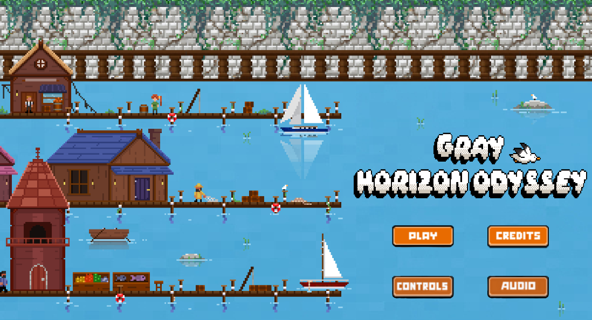
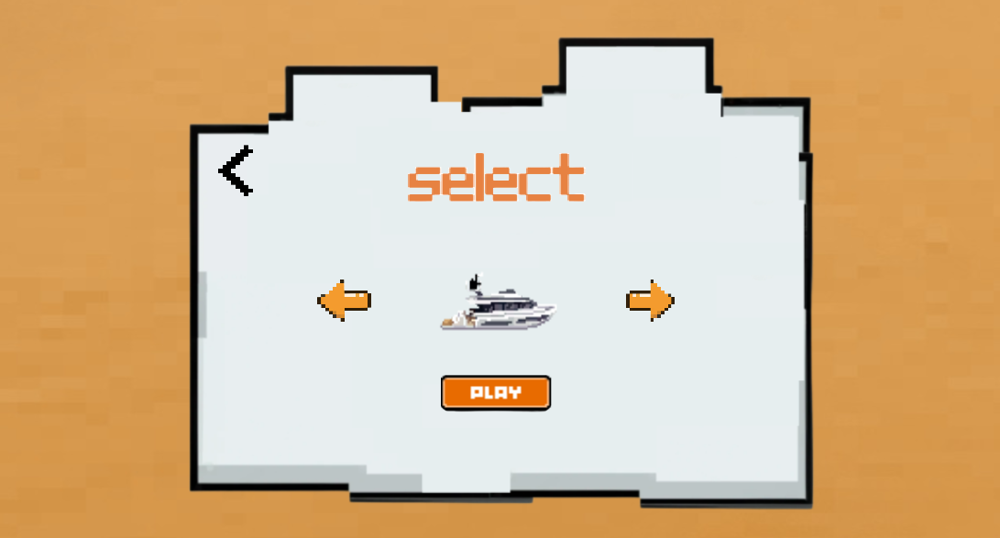
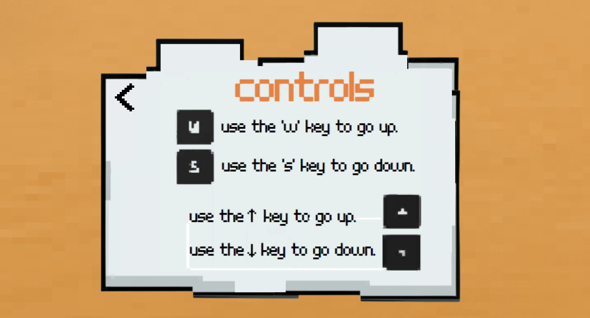
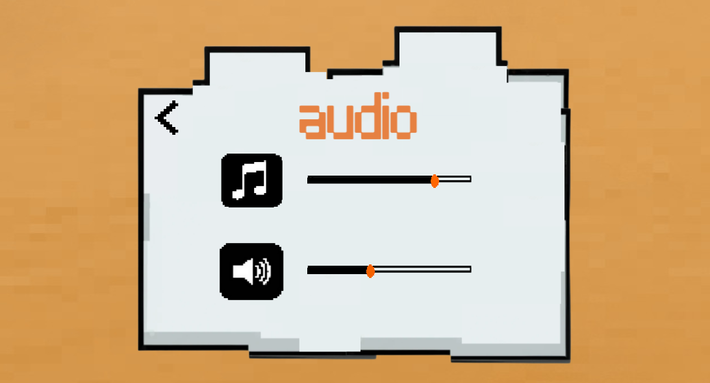
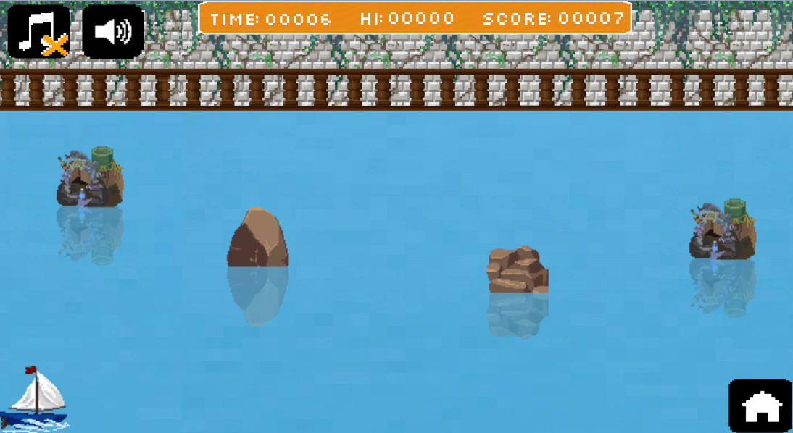

# Gray Horizon Odyssey

## What is this?
Gray Horizon Odyssey is a fast-paced 2D infinite runner built in Unity, designed with custom assets, dynamic scoring, and multiple playable characters.

## Usage

Gray Horizon Odyssey is available to play on the following platforms:

  &emsp;🎮 [Newgrounds](https://www.newgrounds.com/portal/view/918786)

  &emsp;🎮 [Itch.io](https://franco-pieri.itch.io/gray-horizon-odyssey)

## Screenshots

## License
This program is free software: you can redistribute it and/or modify it under the terms of the license.
